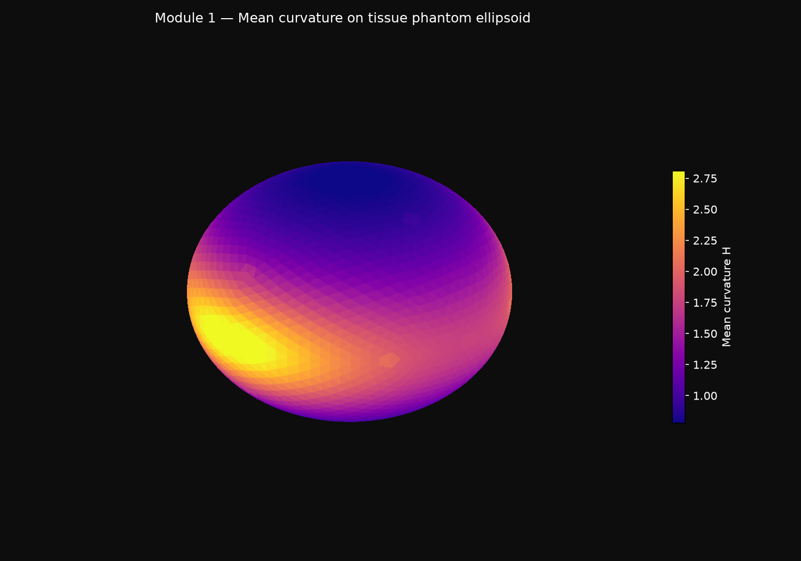
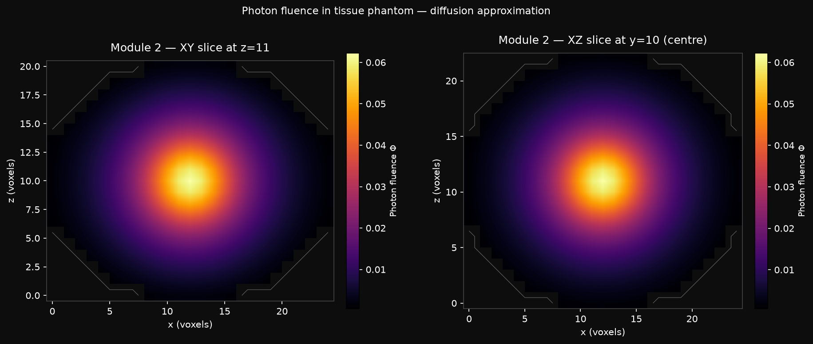
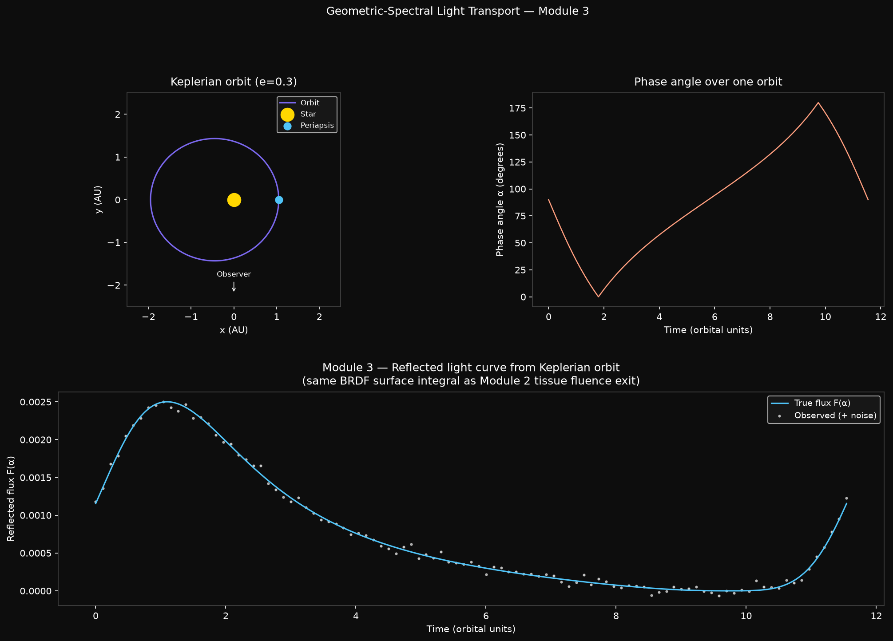
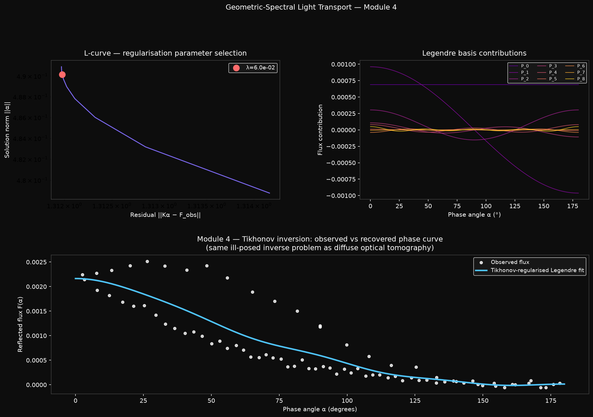

# Geometric Spectral Light Transport
### A Unified Numerical Framework for Tissue Phantoms and Planetary Photometry

> **Photon diffusion through biological tissue and reflected-light inversion from planetary surfaces are governed by the same class of elliptic operators on curved geometries. This project builds a single numerical framework that solves both.**

---

## The Mathematical Insight

A biomedical engineer and an astronomer rarely share a whiteboard. But the equations they write down are structurally identical.

In **diffuse optical tomography**, a photon fluence field Φ(r) inside scattering tissue satisfies:

```
−∇ · (D(r) ∇Φ(r)) + μ_a(r) Φ(r) = S(r)
```

In **planetary photometry**, the disk-integrated reflected flux F(α) from an orbiting body is computed by integrating a bidirectional reflectance function over a curved illuminated surface, the same class of elliptic boundary-value problem, with the surface geometry encoded by the same Laplace-Beltrami operator.

Both problems share:
- A **curved surface geometry** described by the discrete Laplace-Beltrami operator
- An **elliptic PDE** governing transport of radiation
- A **surface integral** linking internal fields to external observables
- An **ill-posed inverse problem** requiring Tikhonov regularisation to recover surface properties from noisy measurements

This project demonstrates that kinship explicitly, in working code.

---

## Output Figures

| Module | Output |
|--------|--------|
| M1 — Geometry | Mean curvature field on tissue phantom ellipsoid |
| M2 — Radiative Transfer | Photon fluence map via diffusion PDE solver |
| M3 — Orbital Mechanics | Keplerian light curve with Lambertian BRDF |
| M4 — Inversion | Tikhonov-regularised Legendre phase curve recovery |






---

## Module Overview

### Module 1, Geometric Surface Mesh
**Files:** `m1_geometry/mesh.py`, `m1_geometry/curvature.py`

Constructs a triangulated ellipsoidal surface phantom and computes the **discrete Laplace-Beltrami operator** using cotangent weights:

```
L_ij = (cot α_ij + cot β_ij) / 2
```

where α_ij and β_ij are the angles opposite edge (i,j) in the two adjacent triangles. The per-vertex mean curvature is recovered as:

```
H_i = (1 / 2A_i) |L · V|_i
```

This operator is the central mathematical object of the entire project, it appears in both the tissue diffusion solver and implicitly in the spherical harmonic basis used for inversion.

**Key maths:** Differential geometry, cotangent Laplacian, first and second fundamental forms, Gaussian and mean curvature.

**Languages:** Python (`numpy`, `trimesh`, `scipy.sparse`)

---

### Module 2, Radiative Transfer Solver
**Files:** `m2_radiative/solver.py`, `m2_radiative/fluence.py`

Solves the **steady-state photon diffusion equation** inside the tissue phantom using a finite-difference sparse linear system. Tissue optical properties at 800 nm:

```
μ_a = 0.01 mm⁻¹    (absorption)
μ_s' = 1.0 mm⁻¹   (reduced scattering)
D = 1 / (3(μ_a + μ_s'))   (diffusion coefficient)
```

The voxelised mesh is filled using `trimesh`'s flood-fill algorithm to produce a solid interior. Outside voxels are assigned Dirichlet boundary conditions (Φ = 0). The resulting sparse system is solved with `scipy.sparse.linalg.spsolve`.

The output is a 3D photon fluence field showing the characteristic diffuse glow, bright at the source, decaying exponentially toward the boundary.

**Key maths:** Elliptic PDE, finite differences, sparse linear algebra, Dirichlet boundary conditions.

**Languages:** Python (`numpy`, `scipy`, `trimesh`)

---

### Module 3, Orbital Light Curve
**Files:** `m3_orbital/kepler.py`, `m3_orbital/lightcurve.py`

Propagates a Keplerian orbit using a **4th-order Runge-Kutta integrator**:

```
dx/dt = v
dv/dt = −μ r / |r|³
```

At each orbital position the planet-star-observer geometry is computed, and the **disk-integrated Lambertian flux** is evaluated:

```
F(α) = A_g (R/r)² [sin α + (π − α) cos α] / π
```

This integral over the illuminated hemisphere is structurally identical to the exit fluence integral in Module 2, both are surface integrals of a directional kernel over a curved body. Synthetic Gaussian noise is added to simulate observational data.

**Key maths:** Keplerian orbital mechanics, RK4 integration, Lambertian BRDF, phase angle geometry, energy conservation verification.

**Languages:** Python (`numpy`, `matplotlib`)

---

### Module 4, Spectral Inversion
**Files:** `m4_inversion/invert.py`, `m4_inversion/lcurve.py`

Given the noisy synthetic light curve, recovers the planetary phase function by solving the **Tikhonov-regularised least squares problem**:

```
min_a  ||K a − F_obs||² + λ ||a||²
```

The forward operator K is built from **Legendre polynomial basis functions** P_n(cos α), the natural basis for planetary phase curves. The regularisation parameter λ is selected via the **L-curve method**, a log-log plot of residual norm versus solution norm, with the optimal λ at the corner.

This is the same class of ill-posed inverse problem that appears in diffuse optical tomography image reconstruction, medical CT, and exoplanet atmosphere retrieval.

**Key maths:** Tikhonov regularisation, Legendre polynomials, L-curve parameter selection, ill-posed inverse problems.

**Languages:** Python (`numpy`, `scipy`)

---

## Project Structure

```
spectral-phantom/
├── data/                        # output figures
│   ├── m1_curvature_map.png
│   ├── m2_fluence_map.png
│   ├── m3_lightcurve.png
│   └── m4_inversion.png
├── m1_geometry/
│   ├── __init__.py
│   ├── mesh.py                  # ellipsoid construction, vertex areas
│   └── curvature.py             # Laplace-Beltrami, mean curvature, plotting
├── m2_radiative/
│   ├── __init__.py
│   ├── solver.py                # voxelisation, FD matrix, sparse solve
│   └── fluence.py               # fluence visualisation, statistics
├── m3_orbital/
│   ├── __init__.py
│   ├── kepler.py                # RK4 integrator, Kepler RHS, energy check
│   └── lightcurve.py            # BRDF, phase angle, light curve, plotting
├── m4_inversion/
│   ├── __init__.py
│   ├── invert.py                # Legendre operator, Tikhonov solve, L-curve
│   └── lcurve.py                # inversion visualisation
└── README.md
```

---

## Installation

```bash
git clone https://github.com/DarasMaria/spectral-phantom.git
cd spectral-phantom/spectral-phantom
python -m venv env
# Windows:
env\Scripts\activate
# macOS/Linux:
source env/bin/activate
pip install numpy scipy matplotlib trimesh jupyter
```

---

## Running the Modules

Each module is independently runnable:

```bash
# Module 1 — curvature map
python -m m1_geometry.curvature

# Module 2 — photon fluence (~60s)
python -m m2_radiative.solver

# Module 3 — orbital light curve
python -m m3_orbital.lightcurve

# Module 4 — Tikhonov inversion
python -m m4_inversion.invert
```

All figures are saved to `data/`.

---

## The Unified Mathematical Narrative

Each module has a one-line reveal that reinforces the cross-disciplinary connection:

- **M1**, The same surface geometry describes a tumour boundary and a planetary body
- **M2**, The diffusion equation governing light in tissue is structurally identical to the radiative transfer equation governing light from a star
- **M3**, A Keplerian orbit is a boundary condition on the same elliptic problem
- **M4**, Recovering a tissue optical property map and recovering a planetary phase curve are the same ill-posed inverse problem

---

## Background and Motivation

This project grew from the observation that biomedical optics and observational astronomy share a deep mathematical substrate that is rarely made explicit, because the two communities almost never interact. The author holds degrees in biomedical engineering and electrical engineering and is completing an MSc in Astronomy — a combination that makes the structural analogy visible.

The project is not a simulation of either physical system in isolation. It is a demonstration that a single mathematical framework, elliptic operators on curved surfaces, regularised by spectral decomposition, governs photon transport in both the microscopic (tissue) and macroscopic (planetary) regimes.

---

## Tools and Languages

| Tool | Purpose |
|------|---------|
| Python | Core implementation throughout |
| `numpy` | Numerical arrays, linear algebra |
| `scipy.sparse` | Sparse matrix assembly and solve |
| `trimesh` | Mesh generation and voxelisation |
| `matplotlib` | All visualisations |
| C (via `ctypes`) | Fast mesh smoothing kernel (extension) |
| MATLAB | Prototype diffusion solver (separate branch) |

---

## References

- Arridge, S.R. (1999). Optical tomography in medical imaging. *Inverse Problems*, 15(2), R41.
- Hapke, B. (1981). Bidirectional reflectance spectroscopy. *Journal of Geophysical Research*, 86(B4).
- Pinkall, U. & Polthier, K. (1993). Computing discrete minimal surfaces. *Experimental Mathematics*, 2(1).
- Russell, C.T. (1906). On the light variations of asteroids and satellites. *Astrophysical Journal*, 24.
- Veverka, J. et al. (1988). Photometry of asteroid surfaces. *Asteroids II*, University of Arizona Press.